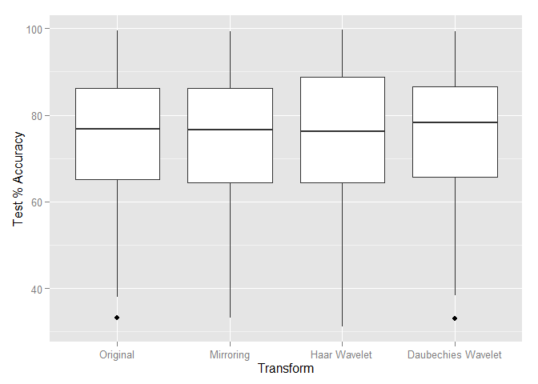
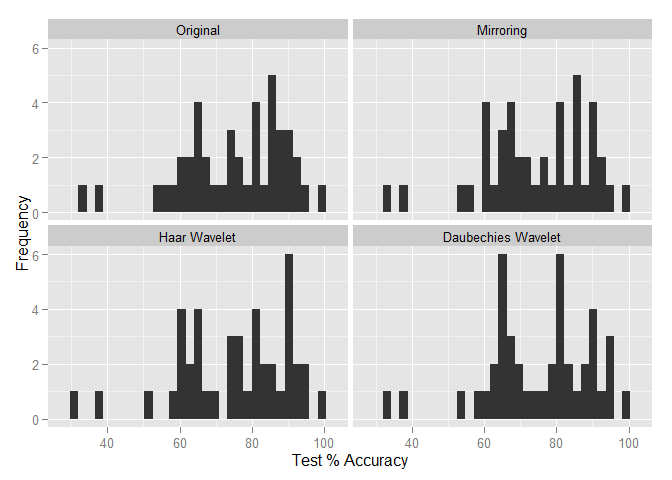
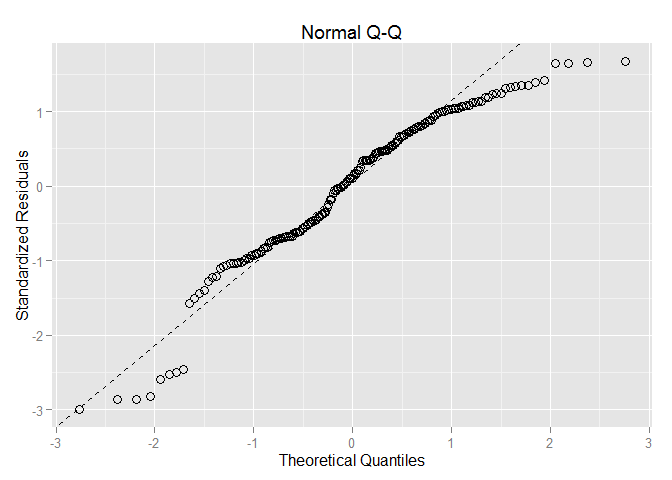

# TestResults_Output
Rob  
04/08/2015  


Load libraries.

```
## 
## Attaching package: 'dplyr'
## 
## The following object is masked from 'package:stats':
## 
##     filter
## 
## The following objects are masked from 'package:base':
## 
##     intersect, setdiff, setequal, union
```

Read in and munge data.


Numerical Summary

```r
## Numerical Summary:
results %>% select(Transform,KNN.Test) %>% group_by(Transform) %>% summarise_each(funs(mean,sd,skewness)) %>% arrange(Transform) 
```

```
## Source: local data frame [4 x 4]
## 
##            Transform     mean       sd   skewness
## 1           Original 75.19960 14.75643 -0.7516030
## 2          Mirroring 74.58733 14.76028 -0.6387128
## 3       Haar Wavelet 75.24747 15.26206 -0.7584041
## 4 Daubechies Wavelet 75.07942 14.77124 -0.6674445
```

Print Plots:
 

```
## stat_bin: binwidth defaulted to range/30. Use 'binwidth = x' to adjust this.
## stat_bin: binwidth defaulted to range/30. Use 'binwidth = x' to adjust this.
## stat_bin: binwidth defaulted to range/30. Use 'binwidth = x' to adjust this.
## stat_bin: binwidth defaulted to range/30. Use 'binwidth = x' to adjust this.
```

  

Set up for ANOVAs.


Print Model Summaries

```r
## Type I Summary
summary(aovmod)
```

```
##              Df Sum Sq Mean Sq F value Pr(>F)
## Transform     3     12    3.93   0.018  0.997
## Residuals   168  37243  221.68
```

```r
## Print the more typical Type III residual SS
drop1(aovmod,~.,test="F")
```

```
## Single term deletions
## 
## Model:
## KNN.Test ~ Transform
##           Df Sum of Sq   RSS    AIC F value Pr(>F)
## <none>                 37243 932.97               
## Transform  3    11.801 37255 927.02  0.0177 0.9968
```

```r
## Non-parametric Kruskal-Wallis Rank Sum Test
kruskal.test(x = results$KNN.Test,g=results$Transform,data=results)
```

```
## 
## 	Kruskal-Wallis rank sum test
## 
## data:  results$KNN.Test and results$Transform
## Kruskal-Wallis chi-squared = 0.0332, df = 3, p-value = 0.9984
```

#Wavelet Matrices:

###Haar Matrix:
$$
\mathbf{H_8}\mathbf{s} = 
\begin{bmatrix}
 1/2 & 1/2 & 0 & 0 & 0 & 0 & 0 & 0 \\
-1/2 & 1/2 & 0 & 0 & 0 & 0 & 0 & 0 \\ 
 0 & 0 & 1/2 & 1/2 & 0 & 0 & 0 & 0 \\
0 & 0 & -1/2 & 1/2 & 0 & 0 & 0 & 0 \\
 0 & 0 & 0 & 0 & 1/2 & 1/2 & 0 & 0 \\ 
 0 & 0 & 0 & 0 & -1/2 & 1/2 & 0 & 0 \\ 
0 & 0 & 0 & 0 & 0 & 0 & 1/2 & 1/2 \\ 
0 & 0 & 0 & 0 & 0 & 0 & -1/2 & 1/2
\end{bmatrix}
\begin{bmatrix}
s_1 \\ s_2 \\ s_3 \\ s_4 \\ s_5 \\ s_6 \\ s_7 \\ s_8
\end{bmatrix} =
\begin{bmatrix}
 (s_1 + s_2)/2 \\ 
 (s_2 - s_1)/2 \\ 
 (s_3 + s_4)/2 \\ 
 (s_4 - s_3)/2 \\  
 (s_5 + s_6)/2 \\ 
 (s_6 - s_5)/2 \\ 
 (s_7 + s_8)/2 \\ 
 (s_8 - s_7)/2
 \end{bmatrix} = 
 \begin{bmatrix}
 Coef_1 \\ Detail_1 \\ Coef_2 \\ Detail_2 \\ Coef_3 \\ Detail_3 \\ Coef_4 \\ Detail_4
 \end{bmatrix}
$$

